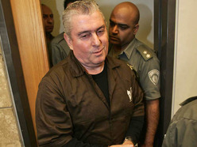

פרשת "כוכב הצפון" מגיעה לסיומה: הפרקליטות תציג מחר (חמישי) לבית המשפט המחוזי בנצרת את הסדר הטיעון שגובש עם העבריין יורם פיניאן, שבמסגרתו יימחק אישום ברצח והצדדים יבקשו לגזור עליו שמונה שנות מאסר בגין סיוע לרצח. הסדר הטיעון יוגש לאחר שבתחילת החודש דחה בג"ץ עתירה של אלמנת הנרצח, אייל שטרית, נגד ההסדר, שהוגשה באמצעות עו"ד דוד ונטורה.

בכתב האישום שהוגש נגד פיניאן ב-2009 נטען, כי הוא היה אמור לשמש כנהג מילוט ברצח של רון מוסאי, דוד בן מרגי ורפי ויצמן, שנרצחו לעיני בנות זוגם בחוף שלדג בטבריה ב-2001. הרצח הוזמן, כך נטען מאוחר יותר, על ידי זאב רוזנשטיין. רוזנשטיין הואשם אף הוא ברצח בפרשה, אולם הסעיף נמחק בהסדר הטיעון שגובש עמו. פיניאן הואשם גם הוא ברצח של אייל שטרית, אחד ממבצעי הרצח בחוף. זמן קצר לאחר רצח שטרית, נמלט פיניאן מישראל באמצעות דרכון מזויף.

האישום ברצח התבסס בעיקר על עדותו של עד המדינה בפרשה, ס', וכן של אשתו של שטרית. אולם, במהלך פגישות בין הפרקליטות לאשתו של שטרית, היא שינתה חלק מטענותיה, ובין השאר טענה כי עד המדינה עשה יד אחת עם פיניאן כדי לרצוח את המנוח. הפרקליטות חששה שלא תוכל להרשיע את פיניאן, ולכן גיבשה הסדר טיעון עם פרקליטיו, עורכי הדין ליאור אשכנזי ואיתן כבריאן, לפיו האישום ברצח שטרית יימחק, ואילו פיניאן יורשע בסיוע לרצח על חלקו ברצח השלושה.

### "הדברים נבחנו לעומקם ע"י צוות הפרקליטים"
    
האישה עתרה לבג"ץ נגד הכוונה לחתום על הסדר הטיעון, מכיוון שלטענתה רוצח בעלה לא ייענש על מעשיו. אולם, בתחילת החודש דחו השופטים את העתירה, מה שסלל את האפשרות להצגת ההסדר. "נחה דעתנו כי הליך קבלת ההחלטות במקרה זה היה סדור וראוי. הדברים נבחנו לעומקם על ידי צוות הפרקליטים המטפל, אושרו על ידי פרקליטת המחוז, ובסופו של יום, בסיכומם של דיונים נוספים, אושרו על- ידי המשנה לפרקליט המדינה לעניינים פליליים ועל-ידי פרקליט המדינה עצמו", כתבו השופטים בהחלטתם". "עוד שוכנענו כי ההחלטה לגופה אינה חורגת ממתחם הסבירות, במידה המקימה עילה להתערבות שיפוטית".

בחודש נובמבר האחרון הרשיע בית המשפט המחוזי בפתח תקווה, על פי הודאתם, 14 נאשמים המעורבים בפרשה לאחר שהוצג הסדר טיעון בתיק. הם הורשעו בקשירת קשר, וסעיפים שונים של סחר בסמים. אחד מהם הורשע גם בעבירות אלימות. במרכז הפרשה, ניסיון לייבא 108 קילוגרמים של קוקאין מפנמה לישראל.

 
<a class="article-logo" href="http://news.walla.co.il/?w=/10/1818658" target="_blank">לקריאה במקור לחץ כאן!</a>

