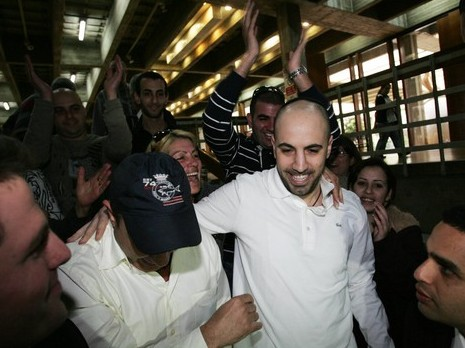
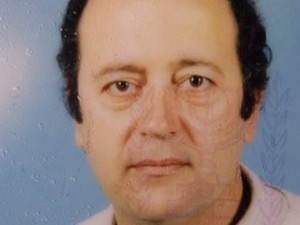

"התחתנתי שנה לפני שנעצרתי. בתי, שחיכיתי לה כל כך הרבה זמן, נולדה בזמן שהיתי במעצר". כך מספר אפי כהן, ששוחרר בשבוע שעבר ממעצר אחרי כמעט שלוש שנים, עם זיכויו מביצוע שוד ורצח בסניף חצי חינם בחולון. עוד ביום שחרורו מיהר כהן המאושר לגן הילדים בו נמצאת בתו הפעוטה כדי לאסוף אותה בסוף יום הלימודים. 

בחודש אפריל 2007, יום לפני ערב חג הפסח, הגיעו שני רעולי פנים חמושים באקדחים אל סניף חצי חינם בחולון במטרה לשדוד את פדיון החנות. השוד הפך לרצח אכזרי של מאבטח החנות, יום טוב דואק. מצלמות האבטחה הוכיחו כי השודדים פשוט הוציאו להורג את דואק, בן 56 במותו, נשוי ואב לשלושה ילדים. 

חודש אחרי הרצח הוגש לבית המשפט המחוזי בתל אביב כתב אישום נגד שלושה מהמעורבים – אפי כהן, שמעון והבה ושמעון לוי, שנעצרו עד תום ההליכים נגדם. על פי כתב האישום, "בעוד דואק שוכב על בטנו ופניו כלפי הרצפה, לקח והבה את נשקו, רכן לעברו, הניח את רגלו על גופו של דואק, ואז הצמיד את האקדח שבידו אל ראשו וירה בו ירייה אחת מטווח קצר אשר גרמה למותו המיידי". 

לפי כתב האישום, מנהל מחלקת דגים בחנות, בחור בשם מאור כהן, מסר לאפי כהן, אז בן 25, מידע אודות נהלי אבטחה פנימיים בחנות, לרבות מספר המאבטחים, שעות פתיחה וסגירה, סכומי פדיון, נהלי העברת כספים ועוד. 

אפי כהן, כך נטען בכתב האישום, העביר את המידע לווהבה ולי, ובהתבסס על המידע שקיבלו תכננו הארבעה בצוותא תוכנית פעולה מפורטת לביצוע מעשה השוד. כספי השלל אמורים היו להתחלק בין הארבעה שווה בשווה. 

בכתב האישום נטען כי סוכם בין הארבעה כי והבה ולוי יבצעו את השוד בפועל, וכי יתגברו
על המאבטחים באמצעות נשק חם. על פי התוכנית, תפקידו של לוי יהיה לקחת בכוח, באיומי נשק, את כספי הפדיון מהקופה הראשית, בשעה שווהבה מחפה עליו מפתח החנות תוך שימוש בירי מנשק. 

בכתב האישום נטען כי שעות אחדות לפני ביצוע השוד המתוכנן, ערך אפי כהן סיור מקדים בסביבת החנות כהכנה למעשה. 

בהמשך אותו היום, שעה וחצי אחרי חצות, הגיעו והבה ולוי אל החניון האחורי של החנות, רכובים על אופנוע וחמושים באקדחים. השניים עטו על פניהם מסיכת סקי להסוואה. 

אולם מעשה השוד הסתבך. דואק המנוח כאמור הוצא להורג, פשוטו כמשמעו, על ידי והבה כשלוי מתבונן בו, ולאחר מכן רץ לוי באקדח שלוף, כשהוא יורה לכל עבר, אל הקופה הראשית שם היו כ-800 אלף שקלים. 

אז הגיח מאחורי גבו עובד החנות, מיכאל סופייב, שלפת את גופו בחוזקה. לוי ירה עליו אך לא פגע בגופו של סופייב, שיחד עם עובדים נוספים תפסו את לוי בחוזקה עד בואה של המשטרה. במקביל נמלט והבה מהחנות. 

### מאור כהן? לא מכיר אותו

בדיוק ביום הולדתו של דואק המנוח, פרסם בית המשפט את הכרעת הדין בפרשה. "אנו אמורים לחגוג יום הולדת לטובי, ובמקום זה נצעד בבוקר לבית המשפט המחוזי ונראה פנים מול פנים את הנאשמים ברצח", כתבה אלמנתו של דואק בבלוג האישי שלה. 

"הפעם נהיה חזקות ונקווה שיד השופטים לא תגרום לזיכויים. ואפילו מילות הנחמה של אמא של שימי שצעקה לו 'אלוהים שומר עליך' לא יעזרו, כי אלוהים לא שומר על רוצחים. וביום הזה נקווה שטובי ינקום בהם מלמעלה וזו תהיה מתנת יום הולדתו. אחר כך נלך לבקרו בבית הקברות, נדליק נר, נבכה, ננקה את הקבר ונספר...".

בית המשפט המחוזי הרשיע את והבה ולוי בביצוע השוד והרצח. אפי כהן זוכה מחמת הספק, ושוחרר ממעצרו. 

עד ליום מעצרו התגורר כהן בחולון, נשוי טרי, ללא עבר פלילי ובעליה של מסעדה בחולון. עד שיום אחד התדפקה המשטרה על דלתו וחייו השתנו מקצה לקצה. 

"הגיעו אליו בכלל דרך מידע מודיעיני", סיפר השבוע עורך דינו ליאור אשכנזי. "בחור בשם מאור עבד ב'חצי חינם' בתור מנהל מחלקת הדגים. המשטרה טענה כי הוא כעובד נידב מידע החוצה לאותם שודדים דרך אפרים כהן, שכביכול דלה ממנו את המידע הזה. 

"מאור היה עד תביעה עיקרי במהלך המשפט. היה לנו מאבק לא פשוט משום שהוא שתק בעדויות שלו. הצלחנו להוכיח כי הוא לא היה עקבי ואף שיקר בכל מיני מקומות וחיפה על אנשים אחרים הקרובים לו כמו אחיו וחברו הטוב, ששוחררו במהלך הפרשה". 

"מאור סתם דיבר עליי", מוסיף כהן, "הוא המציא שטויות". 

**מדוע מאור התמקד דווקא בך?** 

"כמו שאמרתי בבית משפט, כנראה שהיה לו הכי קל להפיל את זה עליי וזה גם מה שבית המשפט קבע. אני בכלל לא מכיר אותו, בסך הכל הייתי חבר של אחד הנאשמים האחרים".

**של מי?** 

"של שמעון והבה". 

עוד טענה הפרקליטות בבית המשפט, כי התבצעו שיחות טלפון רבות בין מאור כהן לאפי כהן. ההגנה דחתה טענה זו, ובמהלך החקירה אף הטיח אפי כהן במאור: "אתה אומר שדיברתי איתך בטלפון ודיברתי איתך ודיברתי איתך, איפה בדיוק דיברתי איתך? אתה יכול להפנות אותנו לשיחות שאני ואתה דיברנו בטלפון?". על כך השיב לו מאור: "אני לא יודע מאיזה טלפון התקשרת". 

אפי כהן חזר ואמר: "למה אני? בגלל שלא רצית להפיל את איציק אחיך ואת אילן החבר שלך? הרי גם הם נעצרו ובוודאי שאת עצמך לא תרצה להפיל". 

בסופו של דבר קבע בית המשפט: "אין מחלוקת כי לא נמצא קשר טלפוני בין מספרו האישי של אפי כהן לבין מאור. ניתוח אמרותיו של מאור כהן מעלות ספקות רבים באשר לקיומה של תקשורת בינו לבין אפי כהן". 

אגב, במהלך החקירה הסתבר כי מאור קיבל הודעת טקסט ממכשיר הטלפון של שרון, אשתו של אפי כהן. כשנשאלה שרון בחקירת המשטרה האם היא שלחה הודעה למאור, הכחישה ואמרה כי ייתכן שבעלה היה השולח. עוד אישרה כי בהחלט ייתכן שבעלה השתמש במכשירה כדי להוציא ממנו שיחות וכי בזיכרון המכשיר היה שמור מספרו של מאור, אולם הכחישה כל קשר טלפוני בינה לבין מאור. 

עו"ד ליאור אשכנזי: "מדובר במידע לא נכון. החוקרים אמרו כי נשלחו הרבה הודעות טקסט למאור למרות שבפועל מדובר רק בהודעה אחת אותה בכלל הכחישה שרון. עקב הכחשתה טענו החוקרים כי אפי הוא זה ששלח את ההודעה. 

בסופו של דבר הסתבר כי אותה הודעה נשלחה בערב פסח עם עוד 65 הודעות אחרות, כלומר היה מדובר בהודעת 'חג שמח' שנשלחה לכל המספרים שהיו לה בפלאפון". 

מדוע מספרו של מאור כהן בכלל היה שמור בפלאפון של אשתו של אפי כהן? 
עו"ד אשכנזי: "היה לה את המספר כי הם הכירו. אחיה אילן לוי היה חבר של מאור. מטבע הדברים מאור שהה הרבה בביתו של לוי, שם בעצם הכירה אותו שרון. אפי מעולם לא הכיר את מאור". 

אשכנזי אומר, כי על סמך עדותו של מאור ועל סמך העובדה שאפי כהן ווהבה היו למעשה חברים, החוקרים עשו חיבור בין הצדדים והאשימו גם אותו ברצח. 

"בסופו של דבר בית המשפט קבע כי ככל הנראה למאור היה כאן אינטרס לשקר. והוא אכן שיקר, הוא לא היה עקבי, ולמעשה חיפה על אחרים. וזה הקטע הכי עצוב, כי יש אחרים שמעורבים בסיפור ומסתובבים חופשי, כי לא עשו חקירה מספיק נכונה, כי שמו זרקור על אפי ולא חשבו לרגע שמאור משקר. 

"אמנם חלק מהחוקרים לא האמינו למאור, אולם התובע והחוקרים האחרים העדיפו כן להאמין לו. היה להם סרט בראש שאפי הוא המוח, הוא שרקם את הכל, שהוא קישר בין כולם, ולפי זה הם הלכו. אפי אפילו לא הכיר את אחד הנאשמים, שמעון לוי. החוקרים בכלל לא חיפשו גיבוי ראייתי לעדותו של מאור, ולכן השופטים זיכו את אפי". 

### כתב אישום? חשכו עיני

נגד אפי כהן נטען עוד כאמור, כי בערב השוד והרצח ביצע תצפיות מודיעיניות על החנות. אפי כהן טען להגנתו, כי בזמן הזה בילה במסיבת רווקים של חברו במועדון "פלמנקו" שנמצא באזור התעשייה בחולון, לא הרחוק מחצי חינם. בזמן השוד והרצח היה במסעדה שבבעלותו. 

עו"ד אשכנזי: "אפי צעק לחוקרים שיסתכלו במחשב של העסק כי הוא היה שם באותו זמן. הם העדיפו להסתמך על תמונה מהצילומים של חצי חינם שבכלל לא דומה לו. שלושה חוקרים העידו כי מדובר באפי, אבל למעשה הם שיתפו אחד את השני בדעותיהם, מה שבכלל פוסל את הזיהוי שאמור להיות אובייקטיבי. 

"הם אמרו אחד לשני 'תגיד שזיהית את אפי', מה שהוכח בבית המשפט. בנוסף מומחה לזיהוי אמר כי הוא לא מזהה על פי הצילומים את אפי. לסיכום, אין בסיס ראייתי להרשעה, וחבל שהיה צריך לחכות שלוש שנים במעצר עד שזה ייצא החוצה".

#### איפה הוא היה עצור כל השנים?

"אפי ישב בכלא הדרים בשרון, זה בית מעצר בתנאים לא סימפטיים. בזמן הזה גם נולדה לו ילדה והוא לא יכל לעשות לה בריתה. אין צורך להרחיב כמה סבל הוא עבר בתקופה הזו. הוא גם לא עבריין, אין לו עבר פלילי, ולהיכנס לבית מעצר שכזה עם אנשים 'סימפטיים' לא מוציא אותו כאיש טוב יותר. 

"הוא עבר הליך לא נעים, ובית המשפט בסוף טען שהוא אמר את האמת. אני ושותפי איתן כבריאן רואים בזיכוי הזה תעודת כבוד לבית המשפט המחוזי, שעשה עבודה ראויה, צלל עמוק לתוך הראיות כפי שהצגנו בסיכומים וקיבל את כל הטענות שלנו למעשה". 

התובע במשפט, עו"ד גיא גורן, מסר: "התוצאה מבחינתנו משביעת רצון. שני הנאשמים העיקריים שביצעו את השוד והרצח הורשעו. השלישי אמנם זוכה, אולם אנו מכבדים את החלטת בית המשפט. המעשה מאוד חמור, ליבנו עם משפחת המנוח שליוו את התיק לכל אורך הדרך. אנו שמחים כי בית המשפט קיבל את כל הראיות שהבאנו לפניו". 

"הייתי בהלם של החיים כשהמשטרה באה אליי", סיפר השבוע כהן, "לא הבנתי מה רוצים ממני, איך הם הגיעו אליי. אבל ההלם עובר עם הזמן ומתחילים לראות איך מתמודדים עם זה. פתרנו בעיה אחרי בעיה". 

####האמנת שתישאר במעצר כל כך הרבה זמן? 

"חשבתי שתוך שלושים יום אני הולך הביתה. לא חשבתי שייקחו את העדות של מאור ברצינות בלי לבדוק. ושעוד יעשו ממנה כתב אישום. הזדעזעתי כשראיתי את כתב האישום, חשכו עיניי ממה שראיתי שם. אז התחלתי להיות יותר מציאותי. הבנתי שעלי לעבוד בשיתוף עם עורכי דין אחרת עוד יכולתי למצוא את עצמי במצב בו לא מאמינים לי". 

### "אני בטוח שהקב"ה היה איתי"

מספר חודשים לאחר שנעצר, ילדה אשתו את בתם היחידה אלה, שכיום היא בת שנתיים וחודשיים. 

"הדבר הכי קשה זה לראות את אלה שאתה אוהב מבעד לסורגים. אני לא מאחל זאת גם לשונאי", הוא מספר. "כשראיתי אותה לראשונה חשתי קצת מנותק מהמציאות. בהתחלה יש התרגשות ואחר כך כשהן הולכות הכל נגמר. הייתי על סף התעלפות, מאוד התרגשתי. חיכיתי לבתי כל כך הרבה זמן. ועוד לראות אותה במקום כזה!". 

**ראית אותה רק פעם בשבוע.** 

"היא מעולם לא ראתה אותי מחוץ לכותלי בית המעצר. פעם בשבוע היא באה לאותו מקום ולא מבינה שמדובר בבית סוהר. היא מבינה שיש אמא ושיש גם אבא מאוד רחוק ושיש סורגים. היא ידעה שמתחם הדרים זה הבית של אבא. אני שמח לפחות שהיא תשכח הכול. אני מקווה שזו חוויה שלא תשפיע עליה". 

משום שכהן נחשב לעציר לא מסוכן, הוא זכה גם לביקורים פתוחים ללא סורגים. "היתה לי תקופה שראיתי אותה הרבה בלי סורגים, אולם לקראת סוף המשפט התדירות ירדה והביקורים נעשו רק מבעד לסורגים". 

**האמנת שתצא לחופשי?** 

"מעולם לא איבדתי את תקוותי שמתישהו אצא לחופשי. האמונה שלי מאוד התחזקה. היום אני בטוח, במיוחד אחרי הזיכוי, שהקדוש ברוך הוא היה איתי. הכול ממנו". 

**איך הגיבה אשתך כשנעצרת?** 

"אשתי האמינה בי לאורך כל הדרך, היא הייתה הכי תומכת שבעולם. הקשר בינינו מאוד חזק, גם עוד לפני, וכרגע הוא הועצם עוד יותר. זה נותן לי ביטחון שיש מאחורי מישהו שלא יזוז ממני סנטימטר". 

**איך הסתדרה אשתך כל השנים האלה מבחינה כלכלית?** 

"הייתה לי מסעדה לפני המעצר. לאחר שלושה-ארבעה חודשים של מעצר היא קרסה משום שלא היה מי שינהל אותה, אבל המשפחה של אשתי עזרה לה". 

**מה חשבו עליך האנשים סביבך? הרי הואשמת ברצח.** 

"בדיוק עברנו לדירה בשכירות, כך שלא ממש הכרנו את השכנים. לאחר תחילת המשפט בעלת הדירה לקחה את הדירה בחזרה, ואשתי עברה לגור עם חמותי. אבל כל המשפחה והחברים שלי האמינו לי, אף אחד לא עזב אותי, גם לא משפחתה של אשתי". 

**מה מרגיש אדם שהוא מבחינתו חף מפשע ויושב כמעט שלוש שנים במעצר?** 

"היו לי תחושות של חוסר אונים, געגועים, לא מצאתי את המקום שלי. לא בדיוק הבנתי היכן אני נמצא. כל הזמן ניסיתי להוכיח את האמת ושיש צדק. כל הזמן צריך לעבוד, ללמוד, להסביר את עצמי". 

**איזה אדם יצאת ממעצר?** 

"לא ראיתי משהו שיכול היה לזעזע אותי, אבל הסיטואציה עצמה משפיעה לכל החיים. להיות נשלט על ידי בחורים שיותר צעירים ממני, זה לא פשוט. לחירות אין מחיר, וכשהיא נלקחת הסכום הכי גדול לא שווה אותה ואת תחושת החופש". 

**חבר שלך הורשע ברצח. מה יש לך לומר על שני הנאשמים שהורשעו?** 

"אני מעדיף לא להתייחס אליהם. כיום אני מכיר אותם יותר טוב". 

**אתה כועס עליהם?** 

"עשיתי החלטה שאני חוזר בתשובה. אני סולח לכולם". 

**איזה סוג אנשים הכרת במעצר?** 

"יש שם כל מיני סוגים של אנשים. רוצחים, אנסים, פדופילים וגם הרבה חפים מפשע ואנשים טובים. יש שם גם רבנים שמלמדים תורה. הכרתי כל מני סוגים של אנשים". 

**איך הסתדרת איתם?** 

"הסתדרתי עם כולם. השתדלתי להתרחק מחלק מהאנשים, לא התווכחתי ולא רבתי. זה לא כמו בסרטים שכולם רבים, אם אני בפינה שלי אין סיבה שיריבו איתי. לא חיפשו אותי". 

**מה עבר עליך יום לפני הכרעת הדין?** 

"תמיד האמנתי וידעתי שאני הולך הביתה. יום לפני הדיון האחרון, ידעתי בהרגשה שאני הולך הביתה. ארזתי את הציוד, אמרתי לאנשים להתראות, ולא חזרתי לשם. עכשיו אני רוצה להתחיל דף חדש. אני לא רוצה להישאר בקשר עם אף אחד מבית המעצר. אני מתכנן לחפש עבודה במשרה מלאה". 

**אינך חושש שבעקבות עברך יהיה לך קשה למצוא עבודה חדשה?** 

"בינתיים לא מצאתי שום דבר, זה ייקח קצת זמן. צריך להתאושש. כרגע המצב קשה ואין לי כסף לפתוח עסק עצמאי. כולם מכירים אותי, אבל בסוף יגיע מישהו שייתן לי הזדמנות. אם בית המשפט קבע שאני זכאי, למה שאחרים לא יאמינו בזה?". 

**יש בך כעס על בית המשפט שזיכה אותך רק מחמת הספק?** 

"זה מעלה שאלות, אך לא באופן מהותי. לפחות אני חופשי". 

**מה הרגשת כשבית המשפט הודיע שאתה זכאי?** 

"לא האמנתי, לא הבנתי מה השופטת אמרה. איך שהיא נכנסה, עוד לא עברה דקה וחצי ואז היא אומרת 'החלטנו לזכות את נאשם מספר שלוש מכל האישומים'. היה קצת הלם ואז שמחה הכי גדולה". 

**מה הדבר הראשון שעשית לאחר שיצאת לחופשי?** 

"לאחר שנפגשתי עם המשפחה בחוץ, הלכתי עם אשתי לאסוף את בתי מהגן בחולון. איני יכול להסביר במילים כמה שההרגשה הייתה טובה לראות את בתי בלי סורגים". 

**מה חשת כלפי משפחתו של יום טוב דואק ז"ל?** 

"זה היה קשה, כי המשפחה הייתה שם כל הזמן. יש להם תמונות ולא קל לראות את זה. אני מרגיש כלפיהם צער. ידעתי גם מה הם חושבים. כואב לי הדברים שהם חשבו עלי לאורך המשפט. אבל אני לא הולך להתעסק בכאב של משפחת הנרצח. שלוש שנים הייתי אחד הרוצחים, אני לא רוצה לפתוח את הכאב והצער שלהם כעת כשאני חופשי". 

**היית רוצה לומר משהו לאלמנתו או ילדיו?** 

"לא יצא לי לדבר איתם. אני גם לא חושב שיש לזה כל כך מקום. אני משתתף בצערם ובחיים לא הייתי עושה דבר שיפגע בהם". 

**איזה אמון אתה רוחש כעת למשטרה ולפרקליטות?** 

"מעולם לא האמנתי בהם, וכיום אחרי התיק אני בכלל לא מאמין להם. התובע היה אכזבה. אולם אני עדיין אוהב את ישראל ואני נשאר לגור בחולון. אני לא חושב שצריך להתחבא ולהתחמק מאף אחד. אני הולך עם ראש מורם. אני גם לא חושש שירדפו אחרי בשנית, בית המשפט הוכיח שאני זכאי". 

<a class="article-logo" href="http://www.nrg.co.il/online/54/ART2/066/660.html" target="_blank">לקריאה במקור לחץ כאן!</a>

