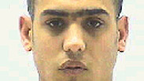

ועדת השחרורים במקום מושבה ליד בית הסוהר השרון הורתה על שחרורו המוקדם של חן ביטון מחדרה, שהורשע בהריגה ונידון ל-15 שנות מאסר.

כשהיו בני 20, חן ביטון ואחיו התאום אור הסתכסכו עם רון נוריאל, עבריין מוכר (25) משכונת בית אליעזר בעיר. באוקטובר 2006 פגשו האחים את נוריאל במסיבה שנערכה בחצר בית של חבר בן 17. שני הצדדים הגיעו למסיבה מצוידים בסכינים. בין התאומים לנוריאל החלו חילופי מילים וקללות על רקע הסכסוך הקודם. נוריאל ניסה לברוח אחרי שהותקף על ידי מספר אנשים. חן ביטון דקר אותו 17 פעמים ואחיו סייע לו. חן הואשם ברצח, אך במהלך המשפט התברר כי נוריאל נהג לאיים על התאומים בתקופה שקדמה לדקירה הקטלנית, ובעסקת טיעון נקבע כי הם יורשעו בהריגה ובסיוע להריגה. חן נשפט ל-15 שנות מאסר, ושוחרר ביום חמישי אחרי 11 שנים. אור נשפט לתשע שנות מאסר וריצה מתוכן שש. 

לתאומים שהיו כאמור בני 20 כאשר נכנסו למאסר, סיפור חיים טראגי. אביהם, מוטי ביטון, נרצח לנגד עיניהם בפיגוע על ידי פלסטינים, כאשר הם היו בני שש בשנת 1992. האב נכנס לכפר ליד ג'נין לרכוש מוצרים. שלושה מחבלים נכנסו אחריו למרכול וירו בו. האם מולי, שהיתה ברכב, ירתה לעבר המחבלים, הצליחה להניסם והצילה את חיי ילדיה.

שלושת הרוצחים ומפקדם מג'נין השתחררו מהכלא הישראלי בשנת 2013, במסגרת עסקה עם ממשלת נתניהו לחידוש המו"מ הישראלי-פלסטיני, כחלק מרשימת 100 אסירים שרצחו ישראלים לפני הסכם אוסלו. 

לאחר שחרור הרוצחים הפלסטינים, סנגוריו של חן ביטון - עורכי הדין איתן כבריאן ויניב פרץ - הגישו בקשת חנינה שנדחתה. "רצח האב לעיני ילדיו הוביל למשבר משפחתי קשה בקשת רחבה של נושאים, הן בפן הנפשי והלך הרוח אשר שרר בבית המשפחה, הן בפן הכלכלי, והן בביטחון האישי של העותר במהלך שגרת חייו כילד וכנער צעיר. התמונות מיום הפיגוע מלוות את העותר יום יום, ותוצאותיו הביאו לנזקים ארוכי טווח, בהם הנשירה מהלימודים וההסתבכות בפלילים", כתבו הסנגורים. האח התאום של חן, אור, שוחרר עוד לפני כן.

במהלך העשור בכלא, חן התחתן ונולדו לו שני ילדים. בשנתיים האחרונות, במסגרת שיקום פרטני, ולאור חוות דעת חיוביות של הגורמים בשב"ס, הוא יצא יום יום מהכלא לעבודה מחוץ לחומות במפעל אזרחי לריהוט ואביזרים לבית.

"מגיל צעיר נכנסתי לכלא, התבגרתי בכלא. היום יש לי אישה עם שני ילדים שמחכים לי בבית, ואני לא זכיתי לכך כשהייתי ילד", אמר ביטון נרגש בשבוע שעבר לוועדת השחרורים שדנה בעניינו. "אבי נרצח בפיגוע, ואת החום והאהבה שלא קיבלתי אני רוצה להעניק לילדים שלי".

הוא הוסיף: "גם אחי התאום שהיה שפוט והשתחרר, עובד באותו מפעל שבו הוא החל לעבוד כאשר היה אסיר - וכיום הוא מנהל שם. לפעמים מהמקומות הכי חשוכים מגיעים למקומות הטובים. אני מבקש את ההזדמנות".

עו"ד כבריאן הוסיף וציין בוועדה את הדוחות הסוציאליים המפרטים את הדרך הארוכה שעשה ביטון בשנות כליאתו. הוא השתתף בתוכניות שיקום מעל שלוש שנים, ובשנתיים האחרונות בשיקום פרטני. עו"ד כבריאן ביקש לתת משקל לנסיבות החיים של האסיר שגדל ללא אב.

נציג הפרקליטות, עו"ד מיטב דגן, הסכים כי "האסיר עבר כברת דרך מרשימה מבחינה טיפולית", אך טען כי נדרש שחרור מדורג. לדבריו, "אסירים שהורשעו בעבירות הריגה יכולים להשתחרר שנה-שנתיים לפני תום המאסר, אך במקרה זה נותרו עוד ארבע שנים וזו תקופה ארוכה שאדם שנטל חיים יהיה ללא פיקוח".

ועדת השחרורים בראשות השופט בדימוס שלמה איזקסון סברה כי תוכנית הרשות לשיקום האסיר שהוצגה להמשך השיקום, מספקת: "האסיר יצא כבר לחופשות רבות שלא נפל בהן דופי. עבירת המשמעת האחרונה שעבר בכלא היא משנת 2006. האסיר עבר מתווים טיפולים משמעותיים. הוא נשא לאישה את חברתו ונולדו לו שני ילדים. התרשמנו מכנותו של האסיר בכל מה שנוגע לרצונו לחזור לחיות חיים נורמטיביים לאחר שגדל בעזובה רגשית. הגענו למסקנה כי האסיר ראוי לשחרור מוקדם ומסוכנותו אויינה". 

<a class="article-logo" href="http://posta.co.il/widgetkit/%D7%9E%D7%93%D7%95%D7%A8%D7%99%D7%9D-1/%D7%9E%D7%90%D7%97%D7%A8%D7%99-%D7%94%D7%A1%D7%95%D7%A8%D7%92%D7%99%D7%9D/14641-%D7%9C%D7%A4%D7%A2%D7%9E%D7%99%D7%9D-%D7%9E%D7%94%D7%9E%D7%A7%D7%95%D7%9E%D7%95%D7%AA-%D7%94%D7%9B%D7%99-%D7%97%D7%A9%D7%95%D7%9B%D7%99%D7%9D-%D7%9E%D7%92%D7%99%D7%A2%D7%99%D7%9D-%D7%9C%D7%9E%D7%A7%D7%95%D7%9E%D7%95%D7%AA-%D7%94%D7%98%D7%95%D7%91%D7%99%D7%9D" target="_blank">לקריאה במקור לחץ כאן!</a>

