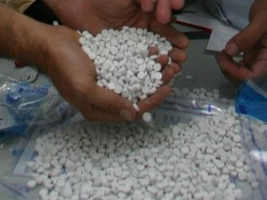

בית המשפט המחוזי בתל אביב גזר בשבוע שעבר שנתיים מאסר בפועל, שנתיים מאסר על תנאי וקנס כספי בסך 40 אלף שקלים על ערן אוחיון, תושב ישראל שהורשע בניסיון הברחת סמים מבלגיה לאוסטרליה. השופט: "העונש שהתקבל במסגרת עסקת טיעון הוא קל מידי ביחס לחומרת המעשים". אוחיון הורשע במסגרת הסדר טיעון כי לפני שש שנים ניסה להבריח 40 אלף כדורי אקסטזי מבלגיה לאוסטרליה שהוחבאו בתוך תמונות עם מסגרות עץ. שירותי המכס בבלגיה גילו את טבליות האקסטזי שהוחבאו בתוך התמונות, הוציאו את חלקן, ושלחו את התמונות לאוסטרליה. כשהגיעה החבילה לשדה התעופה בסידני היא נתפסה על ידי המשטרה הפדרלית האוסטרלית וזו הניחה במקום תכולת הסמים תחליף אחר. כעבור מספר ימים תפסה המשטרה את החבילה ועצרה את בלדר הסמים, תושב ישראלי אף הוא. הבלדר הורשע לפני כחמש שנים וחצי בבית המשפט באוסטרליה במסגרת עסקת טיעון, ריצה שנתיים מאסר ושב לישראל.

### השופט: נהוג לתת עונשים דו ספרתיים 

אוחיון שהיה מואשם בקשירת קשר לייצוא סמים הועמד לדין בישראל ולאחרונה הצליחו סנגוריו, עורכי הדין בני וקרן נהרי ואיתן כביריאן, להגיע להסדר טיעון עם הפרקליטות. על פי הסדר הטיעון, יודה אוחיון באישום השני ואילו האישום הראשון יימחק מכתב האישום. התביעה וההגנה ביקשו לגזור על הנאשם שנתיים מאסר בפועל. שופט בית המשפט המחוזי בתל אביב, חאלד כבוב, קיבל את הסדר הטיעון אך אמר כי מדובר בהסדר טיעון שמקל מאד עם הנאשם וחורג מרמת הענישה המקובלת בעבירות סמים מהסוג הזה. "בייחוד כאשר מדובר בכמות כל כך גדולה של סוג מסם אקסטזי, כ-40 אלף טבליות, שבדרך כלל בגין עבירות שכאלה מטילים בתי המשפט עונשי מאסר דו-ספרתיים", כתב השופט בגזר הדין. יחד עם זאת, השופט ציין כי החליט לכבד את הסדר הטיעון מכיוון שכבר עברו שש שנים מיום ביצוע העבירה. כמו כן, כדי לקיים את המשפט היה צורך בהבאתם של עשרות עדים מבלגיה ואוסטרליה, דבר שהיה גוזל כסף וזמן שיפוטי רב. "מצאתי בסופו של דבר לקבוע שההסדר, אף שהוא מקל עם הנאשם, אינו מצדיק התערבות של בית משפט ועל כן מצאתי לכבדו", הסביר.

<a class="article-logo" href="http://www.nrg.co.il/online/1/ART1/843/249.html" target="_blank">לקריאה במקור לחץ כאן!</a>

