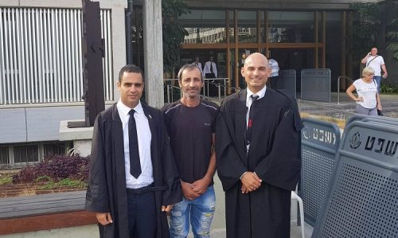

לפני מספר חודשים אמור היה להיכנס יחזקאל סרבי, בן 52 ואב לחמישה, למאסר ממושך שאורכו 7 חודשים – זאת לאחר שבפשיטת שוטרים על ביתו נמצא מעט קנאביס במשקל של פחות מגרם אחד בלבד.

למרות הכמות המזערית, בגלל רקע קודם של עבירות סמים ושימוש בהרואין – ומאחר וזו היתה הפעם הרביעית בה נתפס עם קנאביס – נאלץ השופט שמואל מלמד מבית משפט השלום להפעיל עונשי תנאי קודמים ולקבוע עונש מאסר קשה על סרבי.

המדובר במקרה של מכור להרואין לשעבר הנקי מזה 22 שנה, שסירב בתוקף לקבל טיפול במתדון – החומר שניתן למכורים כטיפול המקובל על בתי המשפט כהגדרת 'טיפול גמילה' – והתעקש על הטיפול בקנאביס רפואי.
על פי סעיף 85 לחוק העונשין, האפשרות היחידה להארכת עונש תנאי חב הפעלה שניתן על עבירות סמים, היא במקרה של 'טיפול בסמים' או גמילה – כלומר שהנאשם נמצא במסגרת של הליך גמילה, זאת לרוב בעזרת נטילת תחליפי סם כדוגמת מתדון.

במקרים רבים עורכי דין מנסים להגדיר בפני בתי המשפט כי טיפולים פסיכולוגיים למשל, עומדים גם הם בהגדרת 'טיפול סמים', אך ללא הצלחה. בהתאם גם קנאביס רפואי מעולם לא הוכר קודם כטיפול כזה באופן דומה למתדון.

סרבי, שיוצג בתחילה על ידי הסניגוריה הציבורית אשר לא פעלה לביטול העונש הקשה, זכה לליווי של עו"ד יניב פרץ ועו"ד איתן כבריאן, מומחים למשפט פלילי המלווים לא אחת את קורבנות מדיניות הפללת צרכני הקנאביס בישראל, שהתנדבו לקחת עליהם את הטיפול בתיק פרו-בונו (ללא תשלום).
"אנו מבטלים את החלטת בימ"ש קמא להפעיל את המאסר על תנאי למשך 6 חודשים שהוטל עליו," כתבו בפסק הדין השופטים דבורה ברלינר, אסתר נחליאלי חיאט ושי יניב. "אנו מורים כי המאסר על תנאי יוארך פעם נוספת מכוח סעיף 85א' לחוק העונשין למשך שנתיים מהיום. אנו מבטלים את עונש המאסר בפועל ומסתפקים בהארכת התנאי."

"פסק הדין ניתן בהסכמת הפרקליטות כך שאינו מתייחס לדברים בהרחבה," מסבירים עורכי הדין פרץ וכבריאן. "אך יחד עם זאת לא ניתן להתעלם מהעובדה שתנאי חב הפעלה הוארך באופן ישיר תודות לרישיון השימוש בקנאביס שקיבל סרבי. הדבר עונה להגדרות סעיף 85 לחוק העונשין הדורש כאמור 'טיפול בסמים'."
הבוקר (ב'), כפי שחשפנו לראשונה בסוף השבוע, נתקבלה טענת הערעור כאמור, במסגרתו הוארכה בפעם הרביעית תקופת עונש מותנה על עבירות סמים ובוטל עונש מאסר שנקבע כדין – תודות לטיפול בקנאביס רפואי.

בעקבות ההחלטה התקדימית מקווים כעת שקנאביס יוכל לשמש כטיפול בגמילה מסמים במקום מתדון, שהינו חומר נרקוטי מלאכותי הניתן כחומר 'תחליף סם' למכורים להרואין ובעצמו סם לכל דבר. לפני מספר חודשים אף הצליחו ברגע האחרון רופאים להציל את חייו של פעוט שבלע מתדון שהיה ברשות אביו.

<a class="article-logo" href="http://www.xn--4dbcyzi5a.com/2017/10/%D7%91%D7%A9%D7%95%D7%A8%D7%94-%D7%9C%D7%9E%D7%9B%D7%95%D7%A8%D7%99%D7%9D-%D7%91%D7%99%D7%94%D7%9E%D7%A9-%D7%94%D7%9B%D7%99%D7%A8-%D7%91%D7%A7%D7%A0%D7%90%D7%91%D7%99%D7%A1-%D7%9B%D7%98%D7%99%D7%A4/" target="_blank">לקריאה במקור לחץ כאן!</a>

